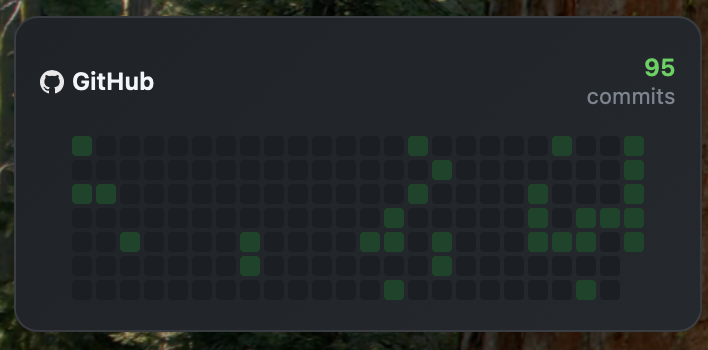

# GitHub Heatmap Widget

A beautiful, compact desktop widget that displays your GitHub contribution heatmap directly on your macOS desktop using [Übersicht](http://tracesof.net/uebersicht/).

## 📸 Preview



## 📘 What is this?

This widget transforms your GitHub contribution data into an elegant desktop display that shows:

* **Contribution Heatmap:** Visual representation of your daily GitHub activity
* **Total Contributions:** Annual commit count prominently displayed
* **Live Updates:** Automatically refreshes every hour to stay current
* **Minimal Design:** Clean, dark interface that complements any desktop setup

Perfect for developers who want to keep their coding streak visible and stay motivated!

---

## 🎯 Requirements

* macOS (any recent version)
* [Übersicht](http://tracesof.net/uebersicht/) - Download here
* GitHub Account with Personal Access Token
* Active internet connection for API requests

---

## 🚀 Setup Instructions

### Step 1: Install Übersicht

* Download Übersicht from [here](http://tracesof.net/uebersicht/)
* Install and launch the application
* Grant necessary permissions when prompted

### Step 2: Download Widget

```bash
# Clone this repository
git clone https://github.com/yourusername/github-heatmap-widget.git

# Or download ZIP and extract
```

### Step 3: Create GitHub Token

1. Go to GitHub **Settings → Developer settings → Personal access tokens**
2. Click **"Generate new token (classic)"**
3. Configure your token:

   * **Note:** Übersicht Widget (or any name you prefer)
   * **Expiration:** Choose your preferred duration
   * **Scopes:** Check only:

     * ✅ `user` - Access user profile information
     * ✅ `read:user` - Read user profile data
4. Click **Generate token**
5. **Copy the token immediately** (you won't see it again!)

### Step 4: Configure Widget

Edit `github.jsx` and replace the placeholder values with your actual credentials:

```javascript
const githubUsername = "your-github-username"; // Replace with your GitHub username
const githubToken = "your-github-token"; // Replace with your GitHub personal access token
```

### Step 5: Install Widget

Move the widget to Übersicht's widgets folder:

```bash
# Method 1: Copy to widgets folder
cp -r github-heatmap-widget ~/Library/Application\ Support/Übersicht/widgets/

# Method 2: Or move the entire folder
mv github-heatmap-widget ~/Library/Application\ Support/Übersicht/widgets/
```

Refresh Übersicht:

* Click Übersicht menu bar icon
* Select **"Refresh all Widgets"**
* Or press `⌘R` while Übersicht is active

### Step 6: Position Widget (Optional)

Edit `github.jsx` to customize position:

```javascript
const widgetLeft = 17;    // Distance from left edge
const widgetTop = 200;    // Distance from top edge  
const widgetWidth = 318;  // Widget width
```

---

## ⚙️ Customization

### Refresh Rate

```javascript
export const refreshFrequency = 3600000; // 1 hour (in milliseconds)
```

### Colors & Styling

Modify the `getColor()` function in `github.jsx` to change heatmap colors:

```javascript
const getColor = (count) => {
  if (count === 0) return "#1a1e23";        // No activity
  else if (count >= 1 && count < 5) return "#0d4429";   // Low activity
  // ... customize other levels
};
```

---

## 🔧 Troubleshooting

| Issue                  | Solution                                                             |
| ---------------------- | -------------------------------------------------------------------- |
| "Unable to load" error | Check if GitHub token is valid and has correct permissions           |
| "Missing GitHub Token" | Ensure credentials are hardcoded or .env file is properly configured |
| Widget not visible     | Verify widget is in correct Übersicht folder and refresh             |
| Data not updating      | Check internet connection and GitHub API rate limits                 |

🛠 **Debug Console:** Right-click Übersicht → "Open Console" to see detailed errors.

---

## 🔒 Security

* ✅ No sensitive data is committed to repository if you use `.env` properly
* ✅ Token uses minimal required permissions
* ⚠️ **Never share your personal access token**

---

## 📄 License

MIT License - see [LICENSE](./LICENSE) file for details.
